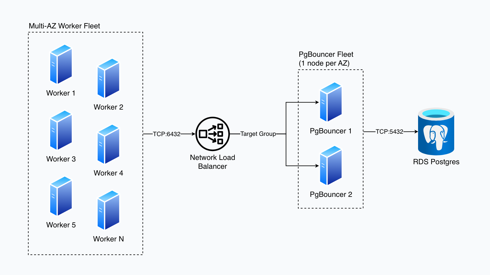

# WebSwarm

WebSwarm is a cloud batch processing system for crawling, analyzing, and classifying millions of websites using AI at massive horizontal scale.

It implements a distributed worker architecture on AWS: many EC2 machines run the same Python worker container, claim jobs through PgBouncer from a shared Postgres queue, process websites independently, and write structured results back.

WebSwarm is built for large-scale AI classification: using language models to extract clearly defined information from millions of websites. Instead of relying on fixed HTML patterns or manually labeled records, WebSwarm interprets page content, structure, and context to turn inconsistent web data into structured datasets. This enables extraction tasks that would have been impossible with traditional scraping pipelines.

## Tech Stack

- **Python** worker runtime
- **Playwright / Chromium** for browser-based webpage fetching
- **LLM-based classification** for extracting structured data from webpages
- **PostgreSQL / AWS RDS** for job state, queue coordination, and results
- **PgBouncer** for database connection pooling
- **Docker** for worker and PgBouncer containers
- **AWS EC2 + Auto Scaling Groups** for horizontally scaled worker and PgBouncer nodes
- **AWS Network Load Balancer** for routing worker traffic to PgBouncer
- **AWS ECR, S3, Secrets Manager, and CloudWatch** for images, caching, credentials, logs, and metrics
- **Terraform** for infrastructure as code

## Cloud Architecture

WebSwarm runs as a horizontally scaled worker fleet on AWS, with workers routing database traffic through an internal Network Load Balancer to multi-AZ PgBouncer nodes.



Worker nodes run on EC2 Spot Instances for cost-efficient batch processing. Each worker maintains a small database connection pool, so PgBouncer is required to scale the system to hundreds or thousands of workers without overwhelming Postgres RDS with direct connections.

Workers and PgBouncer nodes run across multiple Availability Zones. The Network Load Balancer routes worker traffic to PgBouncer, with one PgBouncer node per AZ. This keeps the database access layer available even if an individual node or AZ fails.

All infrastructure is defined in Terraform, with separate state files for persistent and ephemeral resources. Persistent infrastructure includes long-lived components such as the VPC, RDS, S3, Secrets Manager, ECR repositories, and security groups. Ephemeral infrastructure includes worker nodes, load balancing, and other batch-run resources that can be created and destroyed as needed.

This split improves cost control: workers can be spun up for a run, then destroyed afterward. Adding more workers increases parallelism, but does not necessarily increase total compute cost because the same total work can completed in proportionally less time.

## Job Pipeline

Each worker runs the same modular job pipeline:

- **Fetcher** retrieves website content.
- **Parser** extracts usable text and page structure.
- **Searcher** can locate better candidate URLs when the supplied website is missing, irrelevant, or unusable.
- **Classifier** feeds webpage content into AI and generates structured JSON with desired fields.
- **Orchestrator** coordinates fetch, parse, search fallback, follow-up links, classification, and result merging.
- **Trace logging** records what happened during each job for debugging and auditability.

WebSwarm produces structured JSON for every job that can be exported for review and analysis.

## Repository Structure

```
worker/          Python crawler, classification pipeline, and job processor
pgbouncer/       PgBouncer container and configuration
infra/           AWS infrastructure definitions
scripts/         Scripts for importing and exporting sheets to and from Postgres
dev_containers/  Containers to simulate the cloud environment locally for development
```

## Current Use Case: Travel Industry Classification

This implementation of WebSwarm is focused on the travel industry.

It classifies tour operators, experience providers, and related travel businesses by crawling their websites and extracting structured business intelligence.

For each operator, the system can identify fields such as:

- Operator type
- Booking method
- Commercial status
- Operating scope
- Description
- Contact/profile information
- Website relevance
- Whether the site represents a travel experience provider

The travel operator market is highly fragmented. Many companies have small, inconsistent websites with limited standardized metadata. WebSwarm is designed to process that long tail at scale and turn scattered website content into a structured industry dataset.

The goal is to collect data across the travel industry in a way that has not traditionally been available: broad, structured, repeatable, and scalable across millions of web records.
